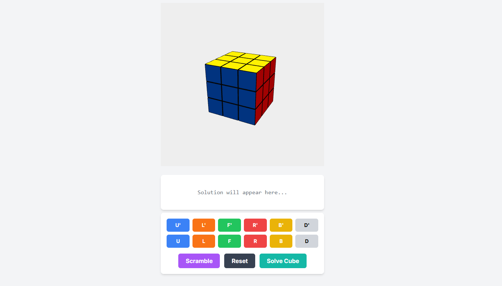

# 🧊 RubiksCube Solver - Frontend

<div align="center">
  
</div>

> **A sleek, interactive, and modern 3D visual interface for solving the Rubik’s Cube, in real-time!**  

Welcome to the **Rubik's Cube Solver** frontend — a visually rich web application designed to help you simulate, input, and solve a Rubik's Cube using modern web technologies and a powerful backend solver.

---

## ✨ Features

🔹 **3D Cube Interface**  
Interact with a fully rendered 3D Rubik's Cube that supports smooth animations, rotations, and real-time visualization.

🔹 **Manual Cube Input**  
Manually set up the cube colors using a color picker or face selectors to match your physical cube.

🔹 **Auto-Solve Mode**  
Click a button, and the solver will display each step to bring your cube to its solved state.

🔹 **Step-by-Step Instructions**  
Get easy-to-understand move-by-move guides (in Singmaster notation) for replicating the solution.

🔹 **Responsive UI**  
Optimized for all screen sizes including desktop, tablet, and mobile.


---

## 🧪 Tech Stack

| Layer         | Technologies Used |
|---------------|-------------------|
| Frontend      | **React**, **Three.js**, **JavaScript**, **Tailwind CSS** |
| Cube Renderer | **Three.js** for 3D cube visualization |
| Styling       | **CSS Modules / Tailwind CSS** |
| API Calls     | RESTful API to connect with backend solver |
| Tooling       | Vite / Webpack, ESLint, Prettier |

---

## 🚀 Getting Started

### Prerequisites
- Node.js (v14 or above)
- npm or yarn

### Installation

```bash
git clone https://github.com/your-username/RubiksCube-Frontend.git
cd RubiksCube-Frontend
open index.html
